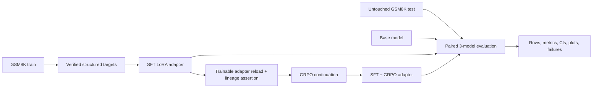
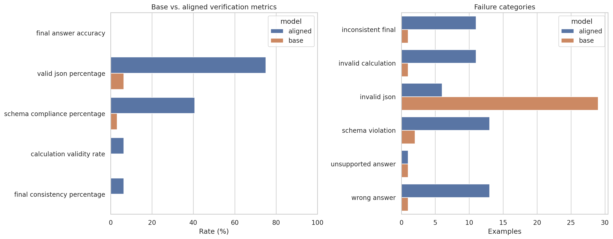
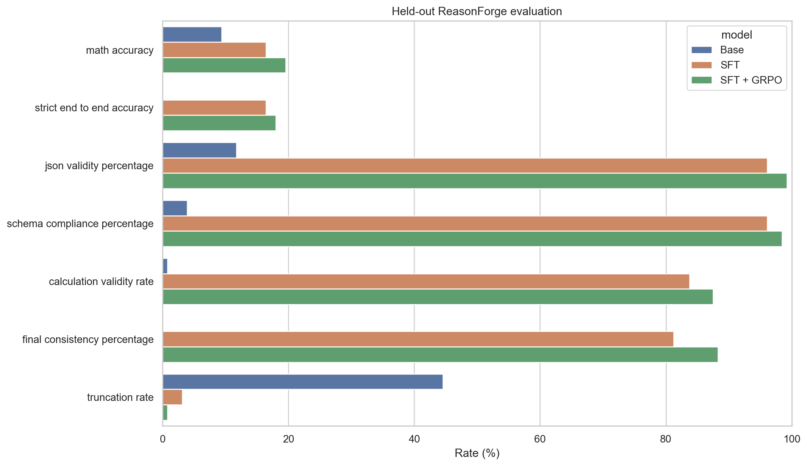

# ReasonForge

ReasonForge is an end-to-end post-training project for small language models that solve arithmetic
word problems as concise, machine-verifiable JSON. It fine-tunes
`Qwen/Qwen2.5-0.5B-Instruct` with a structured-output SFT warm start, then continues the same LoRA
adapter with Group Relative Policy Optimization (GRPO).

## Pipeline



LoRA freezes the base model and learns small low-rank updates to its attention and MLP projections,
making both SFT and GRPO practical on a Colab T4. SFT first teaches the response contract with
completion-only loss. GRPO then samples equal-sized completion groups for each prompt and optimizes
relative reward without training a separate value model. The GRPO stage fingerprints and reloads
the SFT adapter with trainable PEFT weights; it refuses an unrelated adapter or an output path that
would overwrite the SFT checkpoint.

The deterministic curriculum progresses through simple arithmetic, one-step word problems,
fractions/percentages/equations, and multi-step problems. See
[`docs/sft-grpo.md`](docs/sft-grpo.md) for lineage, curriculum, and stability details.

## Structured mathematical verification

The target is exactly one object:

```json
{
  "method": "unit-rate multiplication",
  "calculations": [{"expression": "12 * 5", "result": "60"}],
  "final_answer": "60"
}
```

Pydantic validates the schema. A restricted Python AST accepts only numeric constants,
parentheses, unary signs, and `+ - * / **`; it rejects names, calls, imports, containers,
assignments, non-finite values, excessive exponents, and oversized expressions before rebuilding
the expression as an exact SymPy value. Python `eval` is never used.

Answer extraction is deliberately independent of JSON validity. In descending priority it accepts
a numeric `final_answer` field, explicit final markers such as `####`, `final answer`, `\boxed{}`
or `<final>`, a concise numeric response, then an unambiguous numeric final line. It does not search
arbitrary prose for a reference-looking number and rejects hedged claims. This yields separate
metrics for:

- math accuracy;
- JSON validity and exact-JSON formatting;
- schema compliance;
- structured calculation validity;
- last-calculation/final-answer consistency;
- strict end-to-end accuracy, requiring all of the above and no truncation;
- token-level truncation when generation metadata is available.

## Reward architecture

| Component | Weight | Purpose |
|---|---:|---|
| Schema | 1.0 | Exact JSON and strict schema; merely parseable JSON earns 0.25 |
| Answer correctness | 5.0 | Independent mathematical equivalence to the reference |
| Calculation validity | 2.0 | Fraction of structured calculations that verify |
| Final consistency | 1.5 | Last verified result equals `final_answer` |
| Conciseness | 0.5 | Bounded length, awarded only for correct math |
| Suspicious output | −1.0 | Code-execution or injection-like output penalty |

The enforced ordering is `correct structured > correct malformed > wrong structured > wrong
malformed`. GRPO diagnostics report groups with a correct completion, all-incorrect groups,
correctness and total-reward variance, mean structure reward, unique generations, and likely
truncation. Training logs retain NaN/Inf evidence, explicit gradient clipping is configured, and
the Colab workflow gates the meaningful run on observed health and reward variation.

## Installation

Python 3.11 or 3.12 is recommended:

```bash
python3.11 -m venv .venv
source .venv/bin/activate
python -m pip install --upgrade pip
python -m pip install -e '.[dev]'
```

For NVIDIA training, include the pinned 8-bit optimizer support:

```bash
python -m pip install -e '.[dev,gpu]'
```

## Train: SFT then GRPO

SFT targets are derived only from GSM8K's official training split. The converter verifies
`<<expression=result>>` annotations, requires the final annotation to equal the published answer,
rejects unsupported rows instead of inventing reasoning, records rejection statistics and a
SHA-256 fingerprint, and keeps train/validation source indices disjoint.

```bash
# Short GPU pipeline checks
python -m reasonforge.sft --config configs/sft.yaml --smoke
python -m reasonforge.train --config configs/grpo.yaml --smoke \
  --sft-adapter outputs/sft-smoke-adapter

# Meaningful sequence
python -m reasonforge.sft --config configs/sft.yaml
python -m reasonforge.train --config configs/grpo.yaml
```

The meaningful defaults are 100 SFT steps over up to 1,024 validated targets, followed by 200
GRPO steps over 512 prompts with eight generations per group. The independently loadable artifacts
are `outputs/sft-adapter` and `outputs/sft-grpo-adapter`. Resume either trainer with `--resume` or a
specific checkpoint path. Model weights, adapters, checkpoints, caches, and datasets are ignored
by Git.

### Google Colab

Open [`notebooks/ReasonForge_Colab.ipynb`](notebooks/ReasonForge_Colab.ipynb), select a T4 GPU, and
run the 12 numbered stages in order. The notebook:

1. verifies the runtime and repository commit;
2. installs the pinned stack and runs CPU checks;
3. audits data provenance and structured targets;
4. runs and verifies SFT smoke and meaningful training;
5. proves GRPO initialized from the SFT adapter;
6. inspects group signal and stability stop conditions;
7. runs meaningful GRPO only after the gate;
8. evaluates all three models on 128 paired test examples;
9. renders plots, exposes Gradio, and optionally copies artifacts to Drive.

A T4 runtime is a target, not a guarantee. If the smoke gate detects non-finite metrics, collapsed
reward variance, duplicate generations, or excessive truncation, adjust the checked-in settings
before continuing rather than presenting an unhealthy long run as evidence.

## Evaluation

```bash
python -m reasonforge.evaluate --config configs/evaluation_v2.yaml
python scripts/update_readme_results.py \
  --metrics results/sft-grpo-final/aggregate_metrics.json
```

Base, SFT, and SFT+GRPO use the same seeded examples from the untouched official GSM8K test split
and identical greedy decoding settings. Evaluation writes raw JSONL and CSV rows, aggregate
metrics, two-sided 95% Wilson intervals, representative successes/failures, an evaluation manifest,
a model comparison plot, failure-category plot, and reward-component plot.

## Experiment history and current status

### v1: direct GRPO baseline

The preserved first run used 100 GRPO steps on a Tesla T4 and evaluated 32 paired test examples.
It improved exact JSON from 6.2% to 75.0% and schema compliance from 3.1% to 40.6%, but the original
verifier credited 0/32 math answers for both models. The immutable artifacts remain in
[`results/first-gpu-run/`](results/first-gpu-run/).

A no-regeneration reanalysis of all 64 saved rows is in
[`results/v1-reanalysis/`](results/v1-reanalysis/). The independent extractor finds one correct
base response (1/32, 3.125%) and no correct aligned responses; strict end-to-end accuracy remains
0% for both. Across both conditions it flags 13 likely truncations using a conservative text-only
heuristic, 35 JSON parse failures, 15 schema failures, two rows with valid calculations but an
incorrect final answer, and one mathematically correct answer rejected by the old formatting path.
Because v1 did not store token finish reasons, its truncation counts are explicitly heuristic.



### v2: SFT → GRPO

The implementation, smoke gates, meaningful training, and paired evaluation are complete on one
Tesla T4 with seed 42. A first FP16 SFT trial produced a non-finite first-step gradient and was
rejected. The accepted FP32 SFT run completed 100 steps in 343.6 seconds with train loss 0.2752,
final evaluation loss 0.2162, and zero non-finite events across 105 logged records. The subsequent
FP16 GRPO continuation completed 200 steps in 1,823.1 seconds with train loss 0.0564 and zero
non-finite events across 201 logged records.

On 128 paired held-out examples, math accuracy was 12/128 for base (9.4%, Wilson 95% CI
5.4–15.7%), 21/128 for SFT (16.4%, 11.0–23.8%), and 25/128 for SFT+GRPO (19.5%, 13.6–27.2%).
Strict end-to-end passes were 0, 21, and 23. SFT+GRPO also reached 99.2% JSON validity and reduced
token-level truncation from 44.5% for base and 3.1% for SFT to 0.8%. The SFT and SFT+GRPO
confidence intervals overlap, so the observed four-answer GRPO gain is evidence from this run,
not a claim of a statistically established improvement.

<!-- RESULTS:START -->
| Model | Math accuracy | Strict E2E | JSON valid | Schema | Calc validity | Consistency | Truncated | Avg reward |
|---|---:|---:|---:|---:|---:|---:|---:|---:|
| Base | 9.4% | 0.0% | 11.7% | 3.9% | 0.8% | 0.0% | 44.5% | 0.543 |
| SFT | 16.4% | 16.4% | 96.1% | 96.1% | 83.7% | 81.2% | 3.1% | 4.757 |
| SFT + GRPO | 19.5% | 18.0% | 99.2% | 98.4% | 87.5% | 88.3% | 0.8% | 5.135 |
<!-- RESULTS:END -->

The 200 GRPO groups contained at least one correct completion in 129 groups; 71 were all incorrect
and eight were all correct. Mean total-reward variance was 4.506, mean unique generations was
6.48/8, ten groups had zero total-reward variance, and one of 1,600 sampled completions was flagged
likely truncated. Full raw rows, trainer diagnostics, lineage metadata, and plots are published in
[`results/sft-grpo-final/`](results/sft-grpo-final/).



[Failure categories](results/sft-grpo-final/failure_categories.png) ·
[Reward components](results/sft-grpo-final/reward_components.png)

## Gradio application

```bash
python -m reasonforge.app
```

Open <http://127.0.0.1:7860>. The interface lazily loads base, SFT, and SFT+GRPO policies and shows
each raw response, parsed JSON, independent answer extraction, verification fields, reward
components, completion-token count, finish reason, and truncation status. A missing adapter is
reported in its own panel without breaking the other models.

## Tests and validation

```bash
pytest -q
ruff check .
ruff format --check .
python -m reasonforge.sft --help
python -m reasonforge.train --help
python -m reasonforge.evaluate --help
python -m reasonforge.reanalysis --help
python -m reasonforge.app --help
python -c "import nbformat; nbformat.validate(nbformat.read('notebooks/ReasonForge_Colab.ipynb', 4))"
```

Current CPU validation passes 68 tests, Ruff lint/format checks, all five operational CLI import
checks plus reanalysis, and nbformat validation. GitHub Actions repeats these checks without model
downloads or GPU dependencies.

## Project structure

```text
configs/sft.yaml                   SFT dataset, curriculum, LoRA, and stability settings
configs/grpo.yaml                  SFT-adapter continuation and GRPO settings
configs/evaluation_v2.yaml         Paired base/SFT/SFT+GRPO evaluation
docs/sft-grpo.md                   Lineage, curriculum, and stability notes
notebooks/ReasonForge_Colab.ipynb  Twelve-stage T4 workflow
scripts/                           Notebook builder and measured README updater
src/reasonforge/                   Data, schemas, verification, rewards, training, eval, app
tests/                             CPU-only unit, adversarial, and regression tests
results/first-gpu-run/             Immutable v1 measured artifacts
results/v1-reanalysis/             Separate 64-row v1 diagnostic pass
results/sft-grpo-final/            V2 raw rows, plots, CIs, lineage, and training diagnostics
```

## License

ReasonForge is released under the [MIT License](LICENSE). Dataset and model artifacts retain their
upstream licenses and terms.
