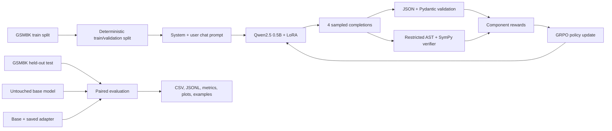

# ReasonForge

> **Status: Ready for first GPU training run.** All 42 CPU-safe engineering tests and release checks pass. GPU training and base-versus-adapter model evaluation are pending; no performance metrics are claimed yet.

ReasonForge is a small-model reinforcement-learning sandbox for a deliberately narrow claim: can GRPO post-training make a 0.5B instruction model produce concise, machine-verifiable arithmetic solutions more reliably? It trains `Qwen/Qwen2.5-0.5B-Instruct` with LoRA on GSM8K prompts and rewards structured JSON, exact arithmetic, reference-answer correctness, and consistency between the final calculation and answer.

The project is an original implementation inspired conceptually by the idea of a GRPO alignment sandbox. It does not reuse code or repository structure from the unlicensed reference project.

> ReasonForge verifies supported calculations and final numeric answers. It does **not** verify unrestricted natural-language reasoning, a model's hidden chain of thought, or mathematical expressions outside its restricted arithmetic language.

## How it works

Group Relative Policy Optimization (GRPO) samples several completions for the same prompt, scores them, and turns their within-group relative quality into an advantage signal. A learned value model is not required. Better completions in a group are reinforced, while a KL term can constrain drift from the reference policy. With four generations, a prompt can produce both malformed and correct candidates; the verifier supplies a dense ranking among them even when the absolute task is hard.



The arithmetic parser accepts only numeric constants, parentheses, unary signs, and `+ - * / **` (with `^` normalized to exponentiation). It limits input length, AST size, exponent size, literal size, and result magnitude. Names, calls, attributes, assignments, imports, containers, and unsupported characters are rejected before expressions are rebuilt as SymPy objects. Python `eval` is never used.

## Response contract

```json
{
  "method": "unit-rate multiplication",
  "calculations": [
    {
      "expression": "12 * 5",
      "result": "60"
    }
  ],
  "final_answer": "60"
}
```

`method` is an unverified short label. Each item in `calculations` is checked in the restricted arithmetic language. The last valid calculation result must equal `final_answer` for the consistency reward.

## Reward design

| Component | Maximum | Encourages |
|---|---:|---|
| Schema | 1.0 | Exact JSON and strict Pydantic schema; merely parseable JSON earns 0.25 |
| Answer correctness | 5.0 | Mathematical equivalence to the held-out reference |
| Calculation validity | 2.0 | Fraction of structured calculations that evaluate to their claimed results |
| Final consistency | 1.5 | Last verified result equals `final_answer` |
| Conciseness | 0.5 | A bounded response, awarded only when the answer is correct |
| Suspicious output | −1.0 | Explicit penalty for obvious code-execution/injection-like tokens |

This weighting makes mathematical correctness dominate presentation. The tests enforce:

```text
correct answer + correct structure
  > correct answer + malformed structure
  > wrong answer + correct structure
  > wrong answer + malformed structure
```

TRL receives the components as separately named reward functions and logs each component plus the trainer's summed reward.

## Setup

Python 3.11 or 3.12 is recommended. A clean local setup is:

```bash
python3.11 -m venv .venv
source .venv/bin/activate
python -m pip install --upgrade pip
python -m pip install -e '.[dev]'
```

For NVIDIA training, install the optional 8-bit optimizer support:

```bash
python -m pip install -e '.[dev,gpu]'
```

Dependencies are pinned around the documented TRL 0.24.0 interface: TRL requires Transformers ≥4.56.1, Datasets ≥3.0.0, and Accelerate ≥1.4.0; its PEFT extra requires PEFT ≥0.8.0. The exact resolved choices are in `pyproject.toml` and `requirements-colab.txt`.

## Dataset and training

The official GSM8K test split is reserved for final comparison. Validation comes only from the official training split. Shuffling, splitting, and subset selection are seeded. Set a subset size to `null` in YAML to use all available examples.

```bash
python -m reasonforge.dataset --config configs/training.yaml
python -m reasonforge.train --config configs/training.yaml
```

The default is an exploratory T4 configuration: 512 train prompts, 100 GRPO steps, four generations, effective single-process batch size four, FP16 on CUDA, gradient checkpointing, and LoRA rank 16. If memory is tight:

```bash
python -m reasonforge.train --config configs/training.yaml --fallback
```

The fallback uses two generations and a shorter completion limit. When `bitsandbytes` and CUDA are detected, training uses paged AdamW 8-bit; otherwise it falls back to torch AdamW. Checkpoints are retained and resumable:

```bash
python -m reasonforge.train --config configs/training.yaml --resume
# or: --resume outputs/reasonforge-adapter/checkpoint-50
```

The Qwen LoRA adapter targets `q_proj`, `k_proj`, `v_proj`, `o_proj`, `gate_proj`, `up_proj`, and `down_proj`: attention and MLP linear projections with most of the model's adaptable computation, while embeddings and the language-model head remain frozen. The final directory includes the adapter, tokenizer, trainer files, and `run_metadata.json` with the resolved configuration, library versions, seed, and hardware.

### Google Colab

Open [`notebooks/ReasonForge_Colab.ipynb`](notebooks/ReasonForge_Colab.ipynb) in a T4 GPU runtime. Set `REPO_URL` in the setup cell after publishing this repository, or upload/open the project at `/content/ReasonForge`. Run the installation, data, and smoke-test cells first. The notebook labels costly training and evaluation cells, provides a three-step demonstration configuration, keeps the 100-step meaningful configuration, launches Gradio, and optionally copies artifacts to Google Drive.

A T4 is the target, not a guarantee: available VRAM and Colab's preinstalled CUDA stack vary. Use `--fallback`, fewer examples, or a shorter completion length if the runtime runs out of memory.

## Evaluation

Evaluation runs the untouched base model and the same base model with the trained adapter on identical official-test examples, prompts, deterministic decoding settings, and seed:

```bash
python -m reasonforge.evaluate --config configs/evaluation.yaml
```

It writes:

- `results/latest/per_example.csv` and `per_example.jsonl`
- `aggregate_metrics.json`
- `comparison.png`
- `representative_examples.json`

Metrics include answer accuracy, valid JSON, schema compliance, calculation validity, final consistency, average total reward, response length, and failure counts. To insert real metrics into the generated block below:

```bash
python -m reasonforge.evaluate --config configs/evaluation.yaml --update-readme
# Or reuse an existing artifact without rerunning models:
python scripts/update_readme_results.py --metrics results/latest/aggregate_metrics.json
```

### Generated results

No training or full model evaluation has been run in this repository yet. The placeholder is intentionally non-numeric.

<!-- RESULTS:START -->
_Run the evaluation command with `--update-readme` to replace this placeholder with real measurements._
<!-- RESULTS:END -->

## Interactive comparison

```bash
python -m reasonforge.app --adapter-path outputs/reasonforge-adapter
```

Open <http://127.0.0.1:7860>. Enter a problem and, ideally, its reference answer. The app lazily loads models, shows base and aligned responses side by side, exposes parsed JSON, calculation-level verification, and each reward component. If no trained adapter exists, it gives training instructions instead of failing at import or startup.

## Development checks

CPU-friendly tests do not download GSM8K or model weights:

```bash
pytest
ruff check .
ruff format --check .
python -m reasonforge.dataset --help
python -m reasonforge.train --help
python -m reasonforge.evaluate --help
python -m reasonforge.app --help
python -c "import nbformat; nbformat.validate(nbformat.read('notebooks/ReasonForge_Colab.ipynb', 4))"
```

The GitHub Actions workflow installs only the verifier's CPU test dependencies, not PyTorch, Transformers, model weights, or GSM8K.

## Project structure

```text
configs/                 Training and evaluation YAML
notebooks/               End-to-end Colab workflow
src/reasonforge/         Dataset, verifier, rewards, training, evaluation, and app
tests/                   CPU-only unit and adversarial tests
results/                 Generated evaluation artifacts (ignored by Git)
pyproject.toml            Package metadata, pins, lint/test configuration
requirements-colab.txt   Colab dependency lock
```

## Limitations and scientific caveats

- GSM8K final answers are scalar numeric values. Equations with free symbols, geometry, units requiring conversion logic, matrices, and arbitrary functions are out of scope.
- A valid calculation trace is evidence that the displayed arithmetic is self-consistent; it is not proof of the model's causal or hidden reasoning process.
- Reward functions are specifications and can have blind spots. Adversarial tests reduce obvious reward hacking but do not prove robustness.
- Small subset experiments have high variance. Report seeds, sample counts, confidence intervals, decoding settings, and failed runs before drawing performance conclusions.
- Training on a benchmark can overfit its style. The held-out split prevents direct row leakage, not distributional contamination inherited from pretraining.
- Generated text remains untrusted. Do not broaden the verifier by adding general code execution.
- Arithmetic accuracy is not a basis for high-stakes financial, medical, legal, or safety decisions.

Future work includes equation-solving via an explicit symbolic schema, additional independently held-out datasets, confidence intervals and bootstrap comparisons, curriculum rewards, property-based parser fuzzing, and constrained JSON decoding as a separately measured intervention.

## Résumé-ready description

Built ReasonForge, an original GRPO/LoRA post-training sandbox for Qwen2.5-0.5B with a restricted AST-to-SymPy verifier, configurable component rewards, leakage-aware GSM8K evaluation, adversarial CPU tests, reproducible Colab training, comparison plots, and a lazy Gradio inspection app.

## License

ReasonForge is released under the [MIT License](LICENSE). Dataset and model artifacts retain their respective upstream licenses and terms.
